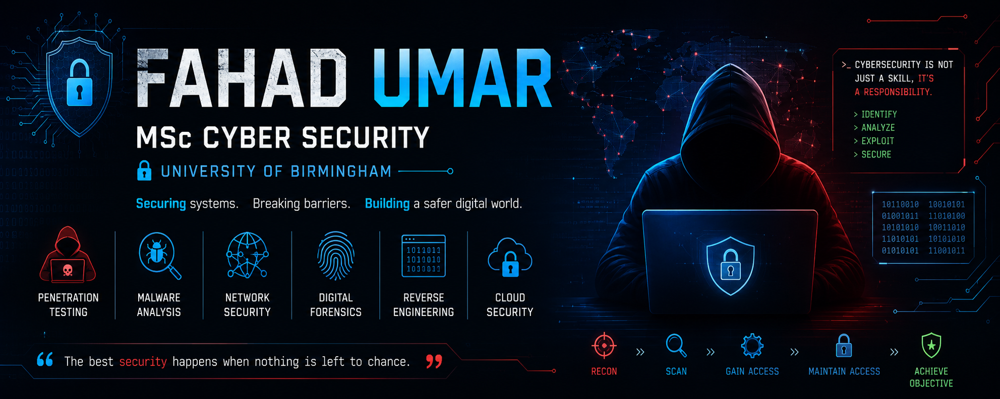

  

<h2 align="center">Hi, I'm Fahad Umar 👋</h2>

<b>MSc Cyber Security @ University of Birmingham| Penetration Testing | Reverse Engineering | Malware Analysis | Digital Forensics | Firmware Security</b>

---
## 🔬 About Me

I am an MSc Cyber Security student at the University of Birmingham with a strong interest in offensive security, malware analysis, reverse engineering, firmware security, and digital forensics. My goal is to understand how systems fail, identify security weaknesses, and develop practical solutions to improve cyber resilience. I enjoy working on projects involving firmware analysis, IoT security, cryptographic systems, network security assessments, and vulnerability research.

I work on problems such as:

* Firmware reverse engineering, binary analysis, and emulation of embedded systems.
* Security evaluation of IoT ecosystems, including device, network, and mobile application components.
* Vulnerability research through fuzzing, protocol analysis, and secure software assessment.
* Static and dynamic malware analysis to understand attacker techniques and defensive strategies.
* Cryptographic protocol analysis, authentication mechanisms, and secure communication architectures.
* Hardware security assessment involving secure boot chains, firmware integrity, and storage encryption technologies.
* Network traffic analysis, intrusion detection, and threat hunting across modern infrastructures.
* Digital forensic investigations and incident response workflows for security event reconstruction.
* Threat modelling and security architecture review to strengthen the resilience of software and hardware systems.

Currently building practical security projects and labs while pursuing my MSc in Cyber Security.

---

## 🔭 Current Focus Areas

⚙️ Firmware rehosting, binary analysis, and reverse engineering of embedded systems

🔍 Vulnerability research through fuzzing, protocol analysis, and secure software assessment

📡 IoT security testing including network traffic analysis, ARP/DNS attacks, and device reconnaissance

🔐 Cryptographic protocol analysis, authentication mechanisms, and secure system design

🦠 Malware analysis using static analysis, dynamic instrumentation, and behavioural investigation

💾 Hardware security involving secure boot chains, firmware integrity, and storage encryption

🌐 Network security monitoring, threat hunting, and incident response workflows

🛡️ Penetration testing of web applications, operating systems, and enterprise environments

🐧 Linux and Windows security, privilege escalation analysis, and system hardening

🚀 Security research projects involving firmware emulation, embedded security, and defensive technologies

- ## 🚀 Featured Security Projects

| Project | Description |
|----------|-------------|
| Firmware Rehosting | Rehosted RP2040 firmware using Unicorn Engine and recovered challenge flags |
| Smart Pet Feeder Pentest | Complete IoT security assessment involving traffic analysis, ARP spoofing and mobile application testing |
| Secure Software Project | Security-focused software development and vulnerability analysis |
| Cryptography Assignments | Practical implementation and analysis of modern cryptographic protocols |

## 🛠️ Tech Stack

### Security

### Programming

### Operating Systems

## 📊 GitHub Stats

## 📫 Connect With Me

- LinkedIn: YOUR_LINKEDIN
- Email: YOUR_EMAIL
